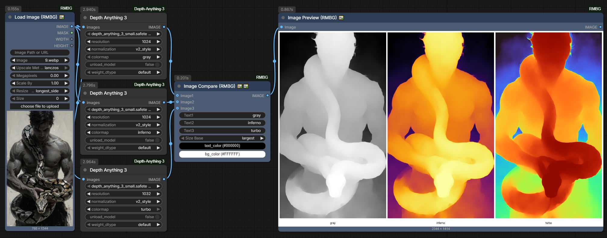
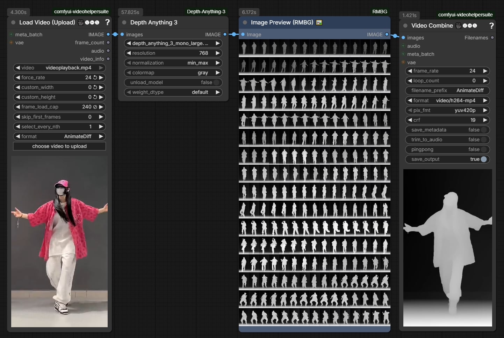

# ComfyUI Depth Anything 3 (DA3)

<p align="center">
  
  
  
  
</p>

**English** | [中文](README_zh.md)

An all-in-one, ultra-fast ComfyUI custom node for **Depth Anything 3 (DA3)** by ByteDance Seed. Designed specifically for generating temporally stable, geometrically accurate **Depth Video Sequences** and single-frame depth maps to guide modern **AI Video Generation** pipelines (such as Wan 2.1, CogVideoX, HunyuanVideo, Stable Video Diffusion, and ControlNet Depth).


---

## News & Updates
- **2026/10/02**: Initial Official Release of ComfyUI-Depth-Anything-3 **v1.0.0** ( [update.md](update.md#v100-20261002) )
  - **All-in-One DA3 Architecture**: Seamless support for `small`, `base`, `mono_large`, and `metric_large` models with automatic Hugging Face downloading.
  - **Pure PyTorch Vectorized Colormap (Zero Matplotlib)**: GPU-native LUT eliminates CPU-GPU transfers and accelerates video batch rendering.
  - **Temporal Consistency for Video**: High-contrast, geometrically stable depth sequence output designed to guide video diffusion models (Wan 2.1, CogVideoX, HunyuanVideo, SVD, and ControlNet Depth).
  - **Ultra-Lean Dependencies**: Only requires `huggingface_hub` (pre-bundled in standard ComfyUI portable packages).
  - **Optimized Memory Management**: Enhanced cache cleanup across CUDA and Apple Silicon (MPS) with safe model unloading (`unload_model`).

---

## Why This Node? Supercharging AI Video Generation

Generating coherent video with AI models (e.g. Wan 2.1, CogVideoX, SVD) often suffers from critical spatial issues:
* **Structural morphing**: Limbs deform, faces melt, and objects shift unrealistically across frames.
* **Spatial flickering & depth collapse**: Backgrounds wobble and fail to maintain consistent perspective when cameras move.
* **Lost edge boundaries**: Thin structures like hair, fingers, branches, and poles blend into the background.

### The Solution: Accurate Depth Maps as 3D Structural Anchors
By passing video frames through this node, you obtain a temporally consistent, high-contrast **Depth Video Sequence**:
1. **Precise 3D Geometry**: Locks down object bounds, character silhouettes, and true depth planes.
2. **Rock-Solid Camera Motion**: Provides rigid geometric conditioning for Depth-to-Video models, eliminating background warping.
3. **Streamlined One-Node Experience**: No need to chain separate loaders, preprocessors, and renderers. Plug your video in, select a model, and get your depth stream ready for generation!


---

## Model Comparison: Why Depth Anything 3?

Depth Anything 3 marks a fundamental paradigm shift from previous disparity-based depth models:

| Feature | Depth Anything V1 / V2 | Video-Depth-Anything | **Depth Anything 3 (DA3)** |
| :--- | :---: | :---: | :---: |
| **Depth Representation** | Disparity (Inverse Depth) | Disparity + Temporal Conv | **Unified Depth-Ray (True Metric & Relative)** |
| **Physical Geometry** | Prone to non-linear distortion | Moderate distortion | **True Euclidean depth with natural perspective** |
| **Edge & Thin Structures** | Blurry around hair & fingers | Moderate blurring | **Razor-sharp edge preservation** |
| **Model Footprint** | Large (>300M) | Heavy (Multi-component) | **Small (80M) / Base (120M) ultra-lightweight** |
| **Auto-Download** | Manual download needed | Manual download needed | **100% Automatic Hugging Face integration** |
| **ComfyUI Integration** | Multi-node pipeline | Multi-node pipeline | **Single all-in-one node (`IMAGE` in, `IMAGE` out)** |

---

## Model Zoo & Selection Guide

All models are automatically downloaded on first run from [1038lab/Depth-Anything-3](https://huggingface.co/1038lab/Depth-Anything-3/tree/main) directly into `ComfyUI/models/geometry_estimation/`.

| Model (`model`) | Parameters | VRAM Footprint | Inference Speed | Recommended Application |
| :--- | :---: | :---: | :---: | :--- |
| **`depth_anything_3_small.safetensors`** | **0.08B** | **~2.8 GB** | **Ultra Fast** | Ideal for long video batches, real-time preview, and low-VRAM GPUs. |
| **`depth_anything_3_base.safetensors`** | **0.12B** | **~3.6 GB** | **Fast** | Best everyday balance of speed, low VRAM, and geometric fidelity. |
| **`depth_anything_3_mono_large.safetensors`** | **0.35B** | **~5.5 GB** | **Standard** | **Top Recommendation for Video Generation Guiding**: Maximum detail on silhouettes, complex textures, and facial features. |
| **`depth_anything_3_metric_large.safetensors`** | **0.35B** | **~5.5 GB** | **Standard** | **True Real-World Metric Units (meters)**: Essential for 3D reconstruction, VFX compositing, and camera tracking. |

---

## Node Parameters Explained

The node is built with simple, intuitive terms and built-in interactive tooltips for every parameter:

| Parameter | Type | Default | Options | What it does (Plain English) |
| :--- | :---: | :---: | :---: | :--- |
| **`images`** | `IMAGE` | *Required* | Image / Video frames | The input video frame batch or single image. Connect directly from `Load Video` (e.g. VHS Video Helper Suite) or `Load Image`. |
| **`model`** | `COMBO` | `small` | Small / Base / Mono-Large / Metric-Large | Which DA3 model to run. Auto-downloads from Hugging Face if not found on your machine. |
| **`resolution`** | `INT` | `504` | 140 ~ 2520 (step 14) | Internal processing size (longest side). `504` is fast and lightweight. Increase to `756` or `1008` for finer edge details. |
| **`normalization`** | `COMBO` | `min_max` | `min_max`, `v2_style`, `raw` | **Depth normalization mode**:<br>• `min_max`: Standard 0–1 depth (White=Near, Black=Far). **Always use this for AI Video Generation & ControlNet!**<br>• `v2_style`: Enhanced perceptual contrast with sky suppression.<br>• `raw`: Preserves physical unscaled depth numbers. |
| **`colormap`** | `COMBO` | `gray` | `gray`, `inferno`, `turbo` | **Visual color style**:<br>• `gray`: Standard grayscale. **Required for Video Gen, ControlNet, and Depth-to-Video**.<br>• `inferno`: Orange-purple heatmap for human inspection.<br>• `turbo`: Rainbow spectrum preview. |
| **`unload_model`** | `BOOLEAN` | `False` | True / False | **Memory management**: Unloads the DA3 model and cleans VRAM caches immediately after execution. Highly recommended when chaining into heavy video generation models (Wan 2.1, CogVideoX, HunyuanVideo). |
| **`weight_dtype`** | `COMBO` | `default` | `default`, `fp16`, `bf16`, `fp32` | **Calculation precision**:<br>• `fp16`: **Recommended for Nvidia GPUs** (cuts VRAM in half and runs much faster).<br>• `bf16`: Best for RTX 30xx/40xx series.<br>• `fp32`: Full precision. |

### Output:
* **`IMAGE`**: Standard ComfyUI image batch containing depth frames matching the exact frame count, aspect ratio, and timing of your input. Connect directly to `Video Combine`, `Preview Image`, or your video generation model.

---

## Quick-Start Settings for Beginners

For the best results with **Video-to-Video** or **Depth-to-Video** generation:
* **`model`**: `depth_anything_3_mono_large.safetensors` (for maximum detail) or `depth_anything_3_small.safetensors` (for fast iterations)
* **`resolution`**: `504` (or `756` for 1080p source)
* **`normalization`**: `min_max`
* **`colormap`**: `gray`
* **`weight_dtype`**: `fp16`

---

## Installation

Clone this repository into your ComfyUI `custom_nodes` folder:

```bash
cd ComfyUI/custom_nodes
git clone https://github.com/1038lab/ComfyUI-Depth-Anything-3.git
```

If using a portable or custom Python environment, install required dependencies:
```bash
pip install -r requirements.txt
```
*(Standard ComfyUI portable packages already include all required libraries)*

Restart ComfyUI and search for **`Depth Anything 3`** in your node menu.

---

## Workflows

Ready-to-use ComfyUI workflow JSON files are available in the [`example_workflows/`](example_workflows/) directory:
* `DA3_depthmap.json`: Single image depth extraction and visualization workflow.
* `DA3_video_depth.json`: High-contrast, temporally consistent video depth sequence extraction workflow for video diffusion models.

---

If this custom node helps you or you like my work, please give me ⭐ on this repo! It's a great encouragement for my efforts!

---

## License & Acknowledgments

* Depth Anything 3 architecture & weights developed by [ByteDance Seed](https://github.com/ByteDance-Seed/Depth-Anything-3).
* Safetensors model checkpoints hosted by [1038lab](https://huggingface.co/1038lab/Depth-Anything-3).
* Model Licensed under the Apache 2.0 License.
* GPL-3.0 License